## UE4 — Графики в трёхмерном пространстве

### Краткое руководство

Приложение разработано для движка Unreal Engine 4 для отрисовки графиков в трёхмерном пространстве. Графики рисуются с использованием компонента Procedural Mesh и имеют различные настройки для стилизации. Все компоненты и функции могут применяться в Blueprint'ах.

Компонент, используемый для отрисовки графиков — ChartViewComponent. Сначала необходимо вызвать функцию CreateChartViewport для создания вьюпорта графика, затем можно добавлять во вьюпорт линии и изменять дизайн графика.

##### Структура проекта:
- ChartViewComponent
    - ChartLinesComponent
        - ChartLineSection
    - ChartBackgroundComponent

*Примечания*: в проекте также содержится класс GameCard, демонстрирующий работу с графиками.

***

#### ChartViewComponent

ChartViewComponent — это компонент, объединяющий в себе фон графика и линии графика. Он должен преобразовывать входные координаты линии под размер окна графика.

ChartViewComponent хранит координаты линий в массиве структур(1), содержащих минимальные и максимальные значения точек линии на всём диапазоне точек, а также на переданном диапазоне.

##### *functions*:
Область видимости | Возвращаемое значение | Название | Назначение
:-:|:-:|-|-|
public | void | CreateChartViewport () | Создаёт график без линий со значениями параметров по умолчанию.
public | void | AddLine ( int32 Index,  const TArray\<FVector2D>& InVertices ) | Добавляет линию на данный график.
public | void | UpdateLine ( int32 Index,  const TArray\<FVector2D>& InVertices ) | Обновляет линию данного графика.
public | void | ClearLine ( int32 Index ) | Удаляет линию данного графика.
public | void | ClearAllLines ()  | Удаляет все линии данного графика.
public | void | SetXRange ( const FVector2D& XRangeValue ) | Устанавливает диапазон отображения точек графика по оси х.
public | void | SetYRange ( const FVector2D& YRangeValue ) | 
public | void | SetXAutoscale ( bool bAuto ) | Устанавливает автомасштабирование по оси х.
public | void | SetYAutoscale ( bool bAuto ) | 
public | void | SetViewportSize ( const FVector2D& ViewportSizeValue ) | Устанавливает размер окна графика.
public | void | SetChartGridType ( EChartGridType Type ) | Устанавливает тип отображения сетки фона графика.
public | void | SetChartBackgroundColor ( const FLinearColor& Color ) | Устанавливает цвет фона графика.
public | void | SetChartGridColor ( const FLinearColor& Color ) | Устанавливает цвет сетки графика.
public | void | SetTextColor ( EChartTextNames Type,  const FColor& Color ) | Устанавливает цвет текста.
public | void | SetTextSize ( EChartTextNames Type,  float Value ) | Устанавливает размер текста.
public | void | SetTextTitle ( const FText& Value ) | Устанавливает заголовок графика.
public | void | SetTextXLabel ( const FText& Value ) | Устанавливает заголовок оси х графика.
public | void | SetTextYLabel ( const FText& Value ) | Устанавливает заголовок оси у графика.
public | void | SetLineWidth ( int32 Index,  float Value ) | Устанавливает ширину выбранной линии графика.
public | void | SetLineColor ( int32 Index,  const FLinearColor& Color ) | Устанавливает цвет выбранной линии графика.
public | void | SetLineType ( int32 Index,  EChartLineType Value ) | Устанавливает тип отображения выбранной линии графика.
public | void | SetLineDashLength ( int32 Index,  float Value ) | Устанавливает длину штриха пунктирной линии.
public | void | SetLineDashInterval ( int32 Index,  float Value ) | Устанавливает расстояние между штрихами пунктирной линии.
private | void | Redraw () | Отрисовка графика.
private | void | Trim () | Обрезка линий под окно графика.

##### *variables*:
Область видимости | Тип переменной | Название | Назначение
:-:|:-:|-|-|
private | bool | bAutoscaleX | Применять ли автоматическое масштабирование по оси х.
private | bool | bAutoscaleY |
private | FVector2D | ViewportSize | Размер окна графика.
private | FVector2D | XRange | Отображаемый диапазон значений в окне графика по оси х.
private | FVector2D | YRange |
private | TArray\<FLine> | Lines | Массив структур(1) линий.
private | UChartBackgroundComponent* | ChartBackgroundComponent | Компонент фона графика.
private | UChartLinesComponent* | ChartLinesComponent | Компонент линий графика.

***

#### ChartLinesComponent

ChartLinesComponent — это компонент, содержащий линии. Он отрисовывает линии по переданным координатам с учётом ширины линии, типа и т. п.

##### *functions*:
Область видимости | Возвращаемое значение | Название | Назначение
:-:|:-:|-|-|
public | void | CreateChartLine ( int32 Index,  const TArray\<FVector2D>& InVertices ) | Создаёт линию с параметрами по умолчанию.
public | void | ClearChartLine ( int32 Index ) | Удаляет конкретную линию.
public | void | ClearAllChartLines () | Удаляет все линии.
public | int32 | GetNumChartLines () const | Возвращает количество линий в компоненте.
public | FLineSection* | GetChartLineSection ( int32 Index ) | Возвращает конкретную линию.
public | void | SetChartLineSection ( int32 Index,  const FLineSection& Section ) | Устанавливает конкретную линию.
public | void | SetChartLineVertices ( int32 Index,  const TArray\<FVector2D>& InVertices ) | Устанавливает координаты точек линии.
public | void | SetChartLineWidth ( int32 Index,  float Value ) | Устанавливает ширину конкретной линии.
public | void | SetChartLineColor ( int32 Index,  FLinearColor Value ) | Устанавливает цвет конкретной линии.
public | void | SetChartLineType ( int32 Index,  EChartLineType Value ) | Устанавливает тип отображения конкретной линии.
public | void | SetChartLineDashLength ( int32 Index,  float Value ) | Устанавливает длину штриха конкретной пунктирной линии.
public | void | SetChartLineDashInterval ( int32 Index,  float Value ) | Устанавливает расстояние между штрихами конкретной пунктирной линии.
public | void | TrimToChart ( const TArray<FVector>& InPlanePositions,  const TArray<FVector>& InPlaneNormals ) | Обрезает все линии по переданным плоскостям.
private | void | UpdateChartLine ( int32 Index,  bool bUpdate = false ) | Отрисовывает/перерисовывает конкретную линию с заданными параметрами.

##### *variables*:
Область видимости | Тип переменной | Название | Назначение
:-:|:-:|-|-|
private | UProceduralMeshComponent* | BackgroundControllerProcMesh | Компонент процедурной сетки, отвечающий за отрисовку линий.
private | UMaterialInterface* | Material | Материал для всех линий.
private | TArray\<FLineSection> | Lines | Массив структур с параметрами линий.
private | float | Step | Расстояние между линиями по оси z.

***

#### ChartLineSection

ChartLineSection — это структура, содержащая параметры линии. По переданным координатам линии возвращает вершины линии, рассчитанные с учётом её параметров.

Файл со структурой содержит также enum значения с типами отображения линии.

##### *enum EChartLineType*:
Название | Назначение
:-:|-|
Solid | Сплошная линия. 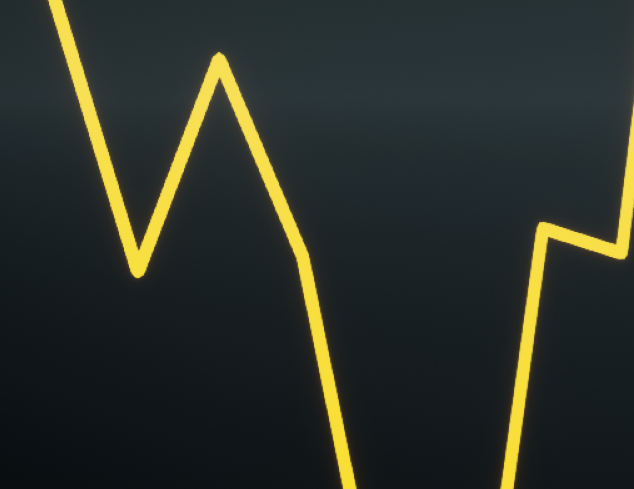
Dashed | Пунктирная линия. 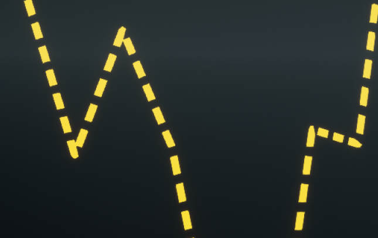
Dotted | Вместо линии отображаются точки. 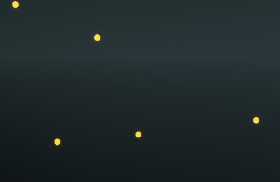

##### *functions*:
Область видимости | Возвращаемое значение | Название | Назначение
:-:|:-:|-|-|
public | void | Reset () | Сбрасывает значения параметров линии к значениям по умолчанию.
public | void | BuildLine ( TArray\<FVector>& OutVertices,  TArray\<FVector2D>& OutUVs ) | Возвращает значения вершин линии и UV-координат с учётом её параметров.
private | void | BuildSolidLine ( TArray\<FVector>& OutVertices,  TArray\<FVector2D>& OutUVs ) const | 
private | void | BuildDashedLine ( TArray\<FVector>& OutVertices,  TArray\<FVector2D>& OutUVs ) const | 
private | void | BuildDottedLine ( TArray\<FVector>& OutVertices,  TArray\<FVector2D>& OutUVs ) const | 
private | bool | BuildInnerVertices ( const FVector& Start,  const FVector& Middle,  const FVector& End,  TArray\<FVector>& OutVertices ) const | Получение координат вершин для стыков линии. 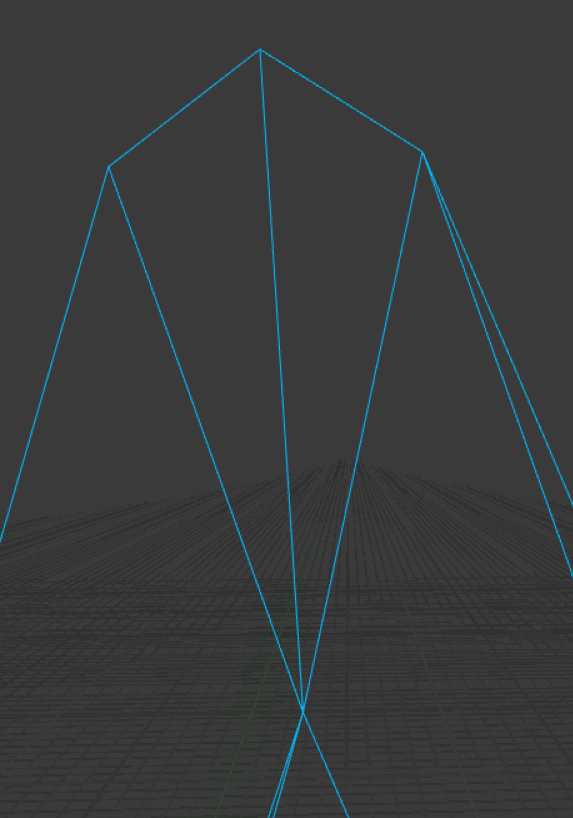
private | void | BuildOuterVertices ( const FVector& Start,  const FVector& End,  TArray\<FVector>& OutVertices,  bool bStart) const | Получение координат граничных вершин. 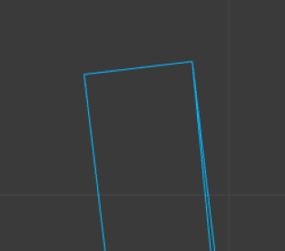
private | float | AttachToDecimalRange ( float Value,  const FVector2D& Range ) const | Нахождение ближайшего значения с заданной десятичной частью в диапазоне.
private | float | AttachToDecimal ( float Value,  float Decimal ) const | Нахождение ближайшего значения с заданной десятичной частью.
private | FVector | InvertAxisYZ ( const FVector& Value ) const | Инвертирование координат по осям у и z.

##### *variables*:
Область видимости | Тип переменной | Название | Назначение
:-:|:-:|-|-|
public | UMaterialInstanceDynamic* | DynMaterial | Динамический инстанс материала линии.
public | float | ZDepth | Глубина линии по оси z.
public | TArray\<FVector2D> | Vertices | Координаты линии.
public | float | Width | Ширина линии.
public | FLinearColor | Color | Цвет линии.
public | EChartLineType | Type | Тип линии.
public | float | DashLength | Длина штриха пунктирной линии.
public | float | DashInterval | Расстояние между штрихами пунктирной линии.

***
#### ChartBackgroundComponent

ChartBackgroundComponent — это компонент, отображающий фон графика. Отображает также числовые значения по осям графика, подписи осей, заголовок графика.

Файл с компонентом фона содержит также enum значения с типами отображения сетки фона и enum значения с типами текста (заголовок, подписи осей и т. п.).

##### *enum EChartGridType*:
Название | Назначение
:-:|-|
NoGrid | Без сетки. 
Solid | Сетка из сплошных линий. 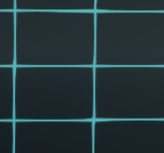
SolidHorizontal | Сплошные линии только по горизонтали. 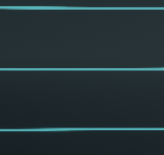
SolidVertical | Сплошные линии только по вертикали. 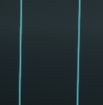
Dashed | Сетка из пунктирных линий. 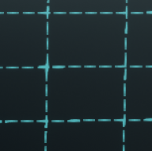
DashedHorizontal | Пунктирные линии только по горизонтали. 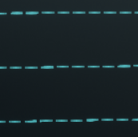
DashedVertical | Пунктирные линии только по вертикали. 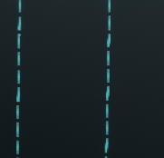
StripedHorizontal | Горизонтальные полосы. 
StripedVertical | Вертикальные полосы. 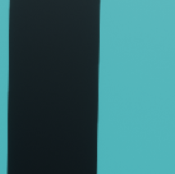

##### *functions*:
Область видимости | Возвращаемое значение | Название | Назначение
:-:|:-:|-|-|
public | void | CreateChartBackground ( const FVector2D& XRangeValue,  const FVector2D& YRangeValue ) | Создаёт фон со значениями по умолчанию.
public | void | SetChartBackgroundXRange ( const FVector2D& XRangeValue ) | Устанавливает диапазон по оси х, в котором отображаются числовые значения.
public | FVector2D | GetChartBackgroundXRange () const | Возвращает диапазон по оси х, в котором отображаются числовые значения.
public | void | SetChartBackgroundYRange ( const FVector2D& YRangeValue ) | Устанавливает диапазон по оси у, в котором отображаются числовые значения.
public | FVector2D | GetChartBackgroundYRange () const | Возвращает диапазон по оси у, в котором отображаются числовые значения.
public | void | SetChartBackgroundViewportSize ( const FVector2D& ViewportSize ) | Устанавливает размеры фона графика по вертикали и горизонтали.
public | FVector2D | GetChartBackgroundViewportSize () const |
public | void | SetChartGridType ( EChartGridType Type ) | Устанавливает тип координатной сетки фона графика.
public | void | SetChartBackgroundColor ( const FLinearColor& Color ) | Устанавливает цвет фона графика.
public | void | SetChartGridColor ( const FLinearColor& Color ) | Устанавливает цвет координатной сетки графика.
public | void | SetTextColor ( EChartTextNames Type,  const FColor& Color ) | Устанавливает цвет текста на выбор: заголовка, числовых значений, подписей осей.
public | void | SetTextSize ( EChartTextNames Type,  float Value ) | Устанавливает размер текста на выбор: заголовка, числовых значений, подписей осей.
public | void | SetTextTitle ( const FText& Value ) | Устанавливает текст заголовка.
public | void | SetTextXLabel ( const FText& Value ) | Устанавливает подпись оси х.
public | void | SetTextYLabel ( const FText& Value ) | Устанавливает подпись оси у. 
private | void | DrawChartBackground () | Отрисовывает (обновляет) фон с заданными параметрами.
private | void | DrawBackgroundPart ( EBackgroundPartNames Part,  const TArray\<FVector2D>& UVs ) | Отрисовывает часть фона на выбор: фон, сетку...
private | void | RenderAxisValuesText ( const FVector2D& ClampedStart,  const FVector2D& Start,  const FVector2D& Step ) | Отрисовывает все текстовые значения.
private | void | SetMaterialGridParams ( EBackgroundPartNames Part,  const FVector2D& VertWidthOffset,  const FVector2D& HorWidthOffset,  float bSecondGridLayer = 0.0 ) | Устанавливает параметры материала для части фона на выбор.
private | void | BuildSolidUVs ( TArray\<FVector2D>& UV0s,  TArray\<FVector2D>& UV1s ) const | Рассчитывает UV-координаты для сетки из сплошных линий по горизонтали и по вертикали.
private | void | BuildSolidUVs ( TArray\<FVector2D>& UVs,  bool bHorisontal = false ) const | Рассчитывает UV-координаты для сетки из сплошных линий только по горизонтали или по вертикали.
private | void | BuildDashedUVs ( TArray\<FVector2D>& UV0s,  TArray\<FVector2D>& UV1s ) const | Рассчитывает UV-координаты для сетки из пунктирных линий по горизонтали и по вертикали.
private | void | BuildDashedUVs ( TArray\<FVector2D>& UVs,  bool bHorisontal = false ) const | Рассчитывает UV-координаты для сетки из пунктирных линий только по горизонтали или по вертикали.
private | void | BuildStripedUVs ( TArray\<FVector2D>& UVs,  bool bHorisontal = false ) const | Рассчитывает UV-координаты для сетки из полос только по горизонтали или по вертикали.
private | float | GetGridStep ( const FVector2D& Range ) const | Рассчитывает шаг между тиками (числовыми значениями по осям).
private | float | GetGridOffset ( float Start,  float Step ) const | Рассчитывает отступ тиков от начальной точки фона.
private | float | AttachToDecimal ( float Value,  float Decimal ) const | Нахождение ближайшего значения с заданной десятичной частью.

##### *variables*:
Область видимости | Тип переменной | Название | Назначение
:-:|:-:|-|-|
private | UProceduralMeshComponent* | BackgroundControllerProcMesh | Компонент процедурной сетки, отвечающий за отрисовку фона.
private | UMaterialInterface* | Material | Материал для фона.
private | TArray<UMaterialInstanceDynamic*> | DynMaterials | Динамические материал инстансы для частей фона (фона, сетки, рамки (не используется в настоящее время)).
private | TArray<UTextRenderComponent*> | AxisValues | Рендер таргеты для отрисовки числовых значений по осям.
private | TArray<UTextRenderComponent*> | TextParts | Рендер таргеты для отрисовки остальных текстовых значений.
private | FVector2D | StepClamped | Шаг между тиками (числовыми значениями по осям), подогнанный под размеры фона.
private | int32 | MaxGridLinesCount | Максимально возможное число координатных линий по обеим осям.
private | float | GridLineWidth | Ширина координатных линий (процент от максимальной размерности (ширины или длины) фона).
private | float | GridDashLength | Длина штрихов координатных линий (только для пунктирной сетки).
private | float | GridDashInterval | Расстояние между штрихами координатных линий (только для пунктирной сетки).
private | int32 | MaximumFractionalDigits | Максимальное количество знаков после запятой у числовых значений.
private | float | TextOffset | Отступы текста от границ фона.
private | float | DistBackgroundParts | Расстояние между частями фона (фоном, сеткой, рамкой (не используется в настоящее время)).
private | float | FrameWidth | Ширина рамки (не используется в настоящее время).
private | FLinearColor | FrameColor | Цвет рамки (не используется в настоящее время).
private | FVector2D | BackgroundViewportSize | Размер фона графика по вертикали и горизонтали.
private | FVector2D | XRange | Диапазон по оси х, в котором отображаются числовые значения.
private | FVector2D | YRange | Диапазон по оси у, в котором отображаются числовые значения.
private | EChartGridType | GridType | Тип координатной сетки.
private | FLinearColor | BackgroundColor | Цвет фона графика.
private | FLinearColor | GridColor | Цвет координатной сетки.
